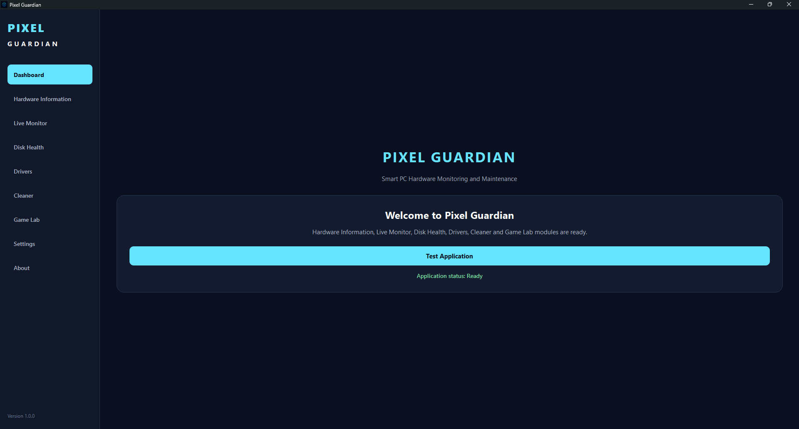
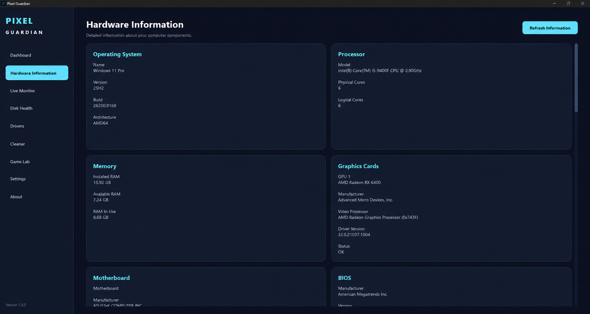
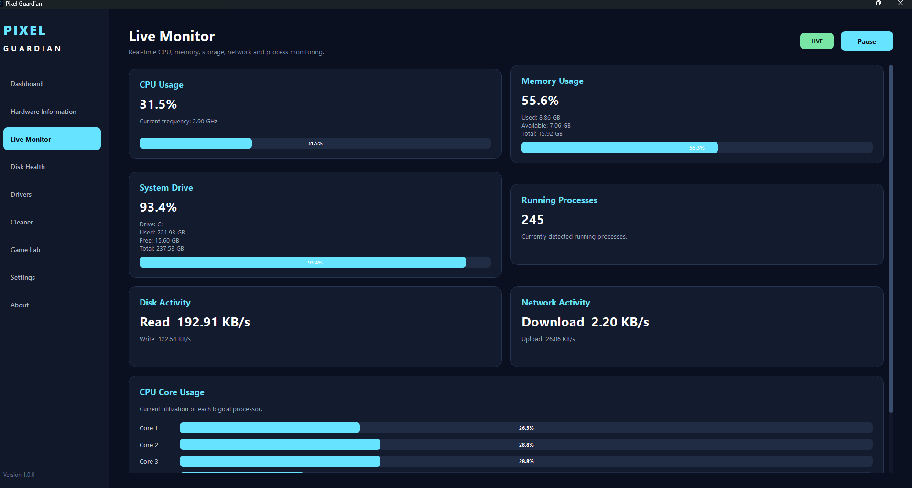
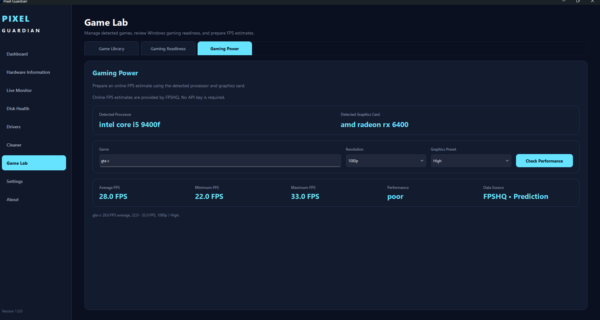
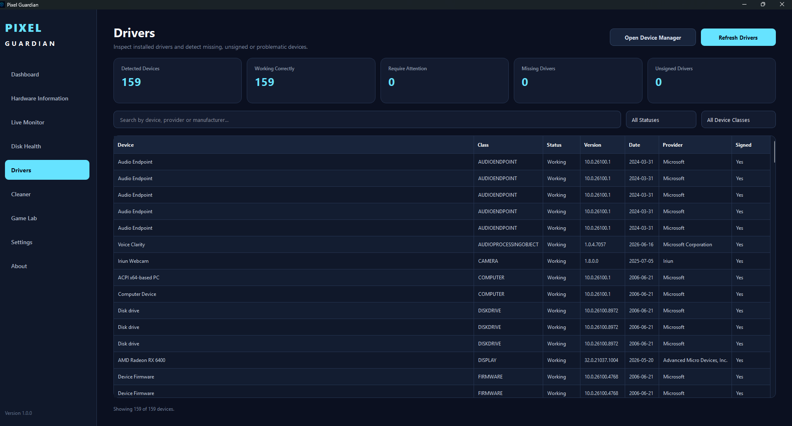
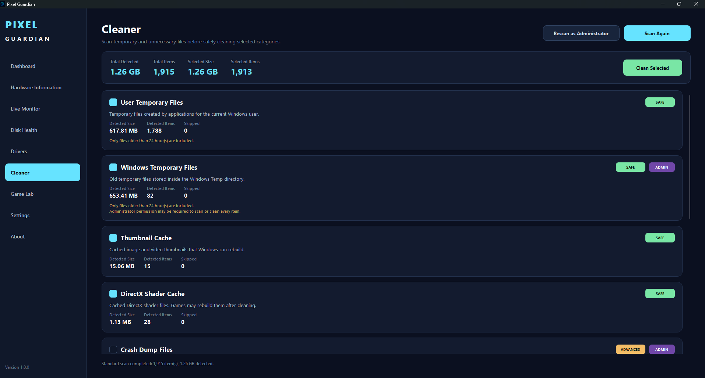

# Pixel Guardian

### Windows PC Monitoring, Maintenance, and Gaming Utilities

Pixel Guardian is a Windows desktop application that brings hardware inspection, real-time system monitoring, driver review, disk-health information, safe temporary-file cleanup, and gaming-performance tools into one interface.

It combines Windows system information, live performance metrics, maintenance utilities, and gaming-focused features in a single desktop workflow.



---

## Overview

Windows system information and maintenance tasks are often spread across several built-in tools and third-party utilities.

Pixel Guardian brings the main workflows into one application:

`Hardware Information` → `Live Monitoring` → `Disk Health` → `Drivers` → `Cleaner` → `Game Lab`

The goal is to make common PC monitoring and maintenance tasks easier to access while keeping system operations controlled and transparent.

---

## Demo

Click the preview below to watch the Pixel Guardian v1.0.0 product demo.

[](PixelGuardian_Demo_Redacted_v2.mp4)

▶ **[Watch the full product demo](PixelGuardian_Demo_Redacted_v2.mp4)**

---

## Key Features

- Detailed hardware and operating-system information
- Real-time CPU, memory, storage, network, and process monitoring
- Per-core CPU utilization
- Disk-health and drive-status information
- Installed driver and device inspection
- Driver search and filtering
- Safe temporary-file scanning before cleanup
- Administrator-aware cleanup operations
- Steam and Epic Games detection
- Windows gaming-readiness checks
- CPU/GPU-based FPS estimates through FPSHQ
- Local caching of successful gaming-performance results
- English and Arabic interface support
- Windows notifications
- System-tray support
- Persistent application settings
- Standalone Windows executable
- Windows installer

---

## Hardware Information

Pixel Guardian detects and displays detailed information about the current Windows system.

Information includes:

- Operating system
- Processor model and core count
- Installed and available memory
- Graphics card information
- Motherboard information
- BIOS information
- Storage and other detected hardware details



---

## Live Monitor

The Live Monitor provides real-time information about current system activity.

It tracks:

- CPU usage
- Memory usage
- System-drive usage
- Running-process count
- Disk read/write activity
- Network download/upload activity
- Per-core CPU utilization

Monitoring can also be paused and resumed directly from the interface.



---

## Game Lab

Game Lab combines detected hardware information with gaming-focused utilities.

It includes:

- Steam and Epic Games detection
- Windows gaming-readiness checks
- Automatic CPU and GPU detection
- Resolution and graphics-preset selection
- FPS estimates through FPSHQ when data is available
- Average, minimum, and maximum FPS estimates
- Local caching of successful performance results



---

## Drivers

Pixel Guardian scans installed Windows devices and presents driver information in a searchable interface.

The Drivers module can display:

- Device name
- Device class
- Current status
- Driver version
- Driver date
- Provider
- Signature state

It can also highlight devices that may require attention and provides quick access to Windows Device Manager.



---

## Safe Cleaner

The Cleaner scans supported temporary-file locations before anything is deleted.

Supported cleanup categories include:

- User temporary files
- Windows temporary files
- Thumbnail cache
- DirectX shader cache
- Crash dump files and other supported cleanup targets

The application separates standard cleanup operations from actions that require administrator permissions and shows detected size and item count before cleaning.



---

## Disk Health

Pixel Guardian detects installed drives and displays available disk-health information.

Depending on Windows permissions and hardware support, the module can show:

- Drive model
- Drive type
- Capacity
- Firmware
- Operational status
- Supported reliability information

Some SMART and reliability data may require administrator access or hardware support from the drive itself.

---

## Application Settings

Pixel Guardian includes persistent application settings for:

- English and Arabic interface language
- Restore last opened page
- Windows notifications
- Notification sounds
- System-tray behavior
- Start minimized behavior

---

## Architecture

Pixel Guardian uses a layered application structure that separates desktop UI code from application logic and Windows-specific system access.

```text
Pixel Guardian UI
       │
       ▼
Application Services
       │
       ▼
Windows Providers / System APIs
```

The main project layers are:

```text
app/              Application bootstrap and startup
core/             Domain models and application services
infrastructure/   Windows providers, logging, paths, and elevation
ui/               PySide6 pages, widgets, navigation, and styles
assets/           Application icons and visual assets
```

This structure keeps system-specific operations isolated from the user interface and makes individual modules easier to maintain and test.

---

## Tech Stack

### Desktop Application

- Python 3.12
- PySide6
- Qt 6

### System Monitoring

- psutil
- Windows system APIs
- Windows Registry
- PowerShell integration

### Packaging & Distribution

- PyInstaller
- Inno Setup 6
- Git
- GitHub

---

## Safety

Pixel Guardian contains system-inspection and cleanup functionality, so potentially destructive operations are intentionally separated from scanning.

The application follows several safety rules:

- Cleanup results are shown before files are removed
- Cleaner operations target predefined supported locations
- Administrator elevation is requested only when required
- Driver functionality is informational
- Pixel Guardian does **not** automatically install or replace drivers

---

## Project Structure

```text
Pixel-Guardian/
│
├── app/
├── assets/
│   └── icons/
├── core/
│   ├── models/
│   └── services/
├── infrastructure/
│   ├── logging/
│   ├── providers/
│   │   └── windows/
│   └── system/
├── screenshots/
├── ui/
│   ├── navigation/
│   ├── pages/
│   ├── styles/
│   └── widgets/
├── run.py
├── requirements.txt
├── PixelGuardian.spec
├── PixelGuardianInstaller.iss
├── build_exe.bat
├── build_installer.bat
└── version_info.txt
```

---

## Running From Source

### Requirements

- Windows 10 or Windows 11
- Python 3.12 recommended

Clone the repository:

```bash
git clone https://github.com/hamzaomar-dev/Pixel-Guardian.git
```

Enter the project directory:

```bash
cd Pixel-Guardian
```

Create and activate a virtual environment:

```bash
python -m venv .venv
.venv\Scripts\activate
```

Install dependencies:

```bash
pip install -r requirements.txt
```

Run Pixel Guardian:

```bash
python run.py
```

---

## Building the Windows Application

Pixel Guardian can be packaged into a standalone Windows application using PyInstaller.

```bash
build_exe.bat
```

The generated application is placed inside:

```text
dist/PixelGuardian/
```

---

## Building the Windows Installer

Pixel Guardian uses Inno Setup 6 to generate a Windows installer.

```bash
build_installer.bat
```

The generated installer is placed inside:

```text
installer_output/PixelGuardian_Setup_1.0.0.exe
```

---

## Current Release

### Pixel Guardian v1.0.0

Current target platform:

**Windows**

The product demo is available above. The packaged Windows installer will be attached to the public GitHub Release for v1.0.0.

---

## Why I Built Pixel Guardian

Pixel Guardian was built as a complete desktop product rather than a collection of disconnected system scripts.

The project combines several development areas into one working application:

- Windows desktop application development
- Hardware and operating-system inspection
- Real-time performance monitoring
- Windows API and system integration
- Driver and device information processing
- Safe file-cleanup workflows
- Gaming-performance utilities
- Application settings and localization
- Windows packaging
- Installer generation
- Testing across real Windows systems

The development process focused on defining each feature, implementing it in stages, testing actual system behavior, identifying failures, and iterating until the complete application worked as a packaged Windows product.

---

## Author

**Hamza Omar**

Computer Science Student  
AI-Assisted Product Builder

GitHub: [hamzaomar-dev](https://github.com/hamzaomar-dev)
